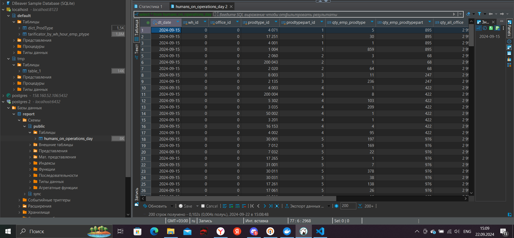

# Airflow & Postgres

## Первый этап

***Clickhouse***

Запуск контейнера:

```shell
docker run -d -p 8123:8123 --name clickhouse-server-practice --ulimit nofile=262144:262144 clickhouse/clickhouse-server
```

Код для Clickhouse: [ch_code.sql](./Clickhouse/ch_code.sql)

После создания таблиц, загружаем CSV-файлы, чтобы заполнить исходные таблицы данными.

Для таблицы `tarificator_by_wh_hour_emp_ptype` сделал выгрузку из 200000 строк по необходимым полям, для таблицы `dict_ProdType` - выгрузил таблицу по двум полям

## Второй этап

***Postgres***

Запуск контейнера:

```shell
docker run --name postgres-wb-practice -e POSTGRES_USER=user -e POSTGRES_PASSWORD=user123 -e POSTGRES_DB=report -p 6432:5432 -d postgres
```

Код для Postgres: [pg_code.sql](./Postgres/pg_code.sql)

## Третий этап

***Airflow***

Файл docker-compose.yaml скачиваем с официального сайта.

После этого выполняем команду

```shell
docker compose up airflow-init
```

После того, как airflow-init закончит свою работу, выполняем:

```shell
docker compose up -d
```

Код для дага: [report_humans_on_operations_day.py](./Airflow/dags/report_humans_on_operations_day.py)

Результат выполнения дага:


