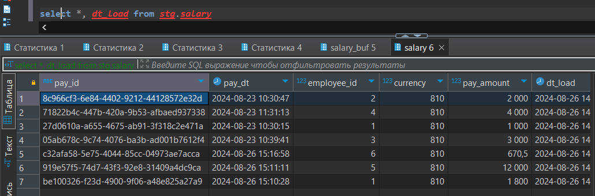
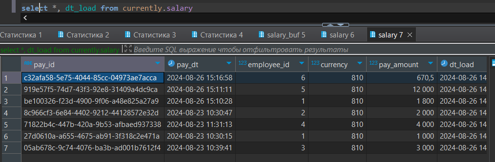

# Clickhouse

## Задание 1

Поднять кликхаус в докере.

```shell
docker run -d -p 8123:8123 --name clickhouse-server-practice --ulimit nofile=262144:262144 clickhouse/clickhouse-server
```

## Задание 2

Настроить пользователя администратора.

Код настройки пользователя: [ch_code_2.sql](./ch_code_2.sql)

## Задание 3

Создать базы для стейджинга, исторических данных, текущих данных и буферных таблиц.

Код: [ch_code_3.sql](./ch_code_3.sql)

## Задание 4

Создать роль только для чтения и роль с возможность создавать и заполнять данные в БД стейджинга(stg). Создать двух пользователей с такими правами по умолчанию.

Код: [ch_code_4.sql](./ch_code_4.sql)

## Задание 5

Реализовать через буфферную таблицу заполнение stg слоя.

Код: [ch_code_5.sql](./ch_code_5.sql)

## Задание 6

Создать матереализованное представление для перемещения данных из stg слоя в слой текущих данных

Код: [ch_code_6.sql](./ch_code_6.sql)

## Задание 7

 Смоделировать вставку данных в буфферную таблицу для stg слоя. В конечном итоге данные должны быть заполнены и в stg слое, и в слое текущих данных.

 Код: [ch_code_7.sql](./ch_code_7.sql)

stg слой:



currently слой:


