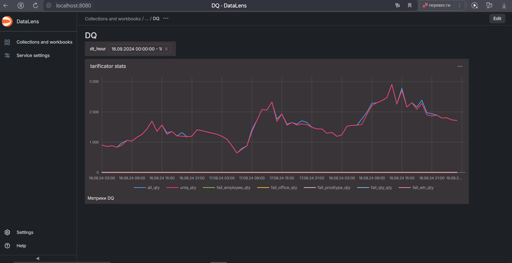

# Data Quality

## Первый этап - Clickhouse

Код для Clickhouse: [ch_code.sql](./Clickhouse/ch_code.sql)

В прошлой домашней работе я использовал урезанную версию таблицы tarificator_by_wh_hour_emp_ptype_dq, поэтому я переиспользую ее в данной домашней работе.

## Второй этап - поднимаем DataLens в Docker

выполняем команды:

```shell
git clone https://github.com/datalens-tech/datalens
cd datalens
docker compose up
```

## Третий этап - Добавляем Clickhouse в сеть DataLens

```shell
docker network connect datalens_default clickhouse-server-practice
```

## Четвертый этап - Дашборд в DataLens

1) Создаем подключение в DataLens к Clickhouse

2) Создаем датасет по таблице dq.tarificator_by_wh_hour_emp_ptype_dq

3) Создаем чарт по датасету

4) Создаю дашборд из чарта и добавляю селектор по dt_hour

