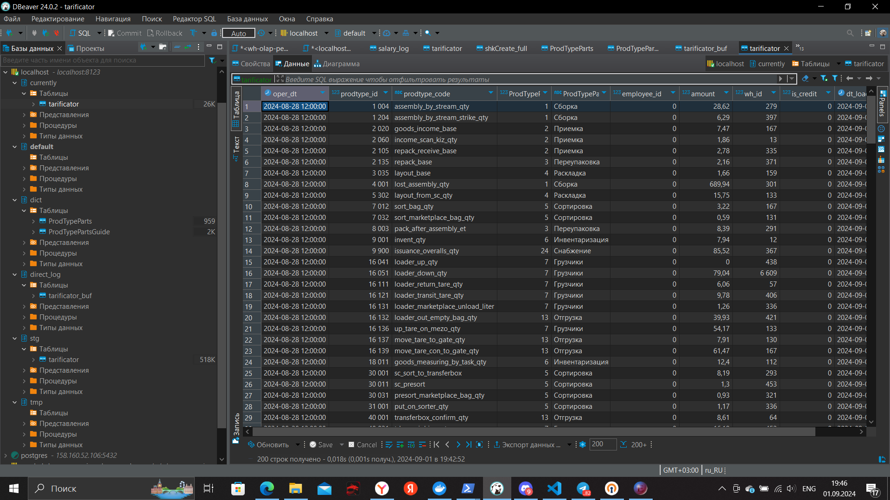
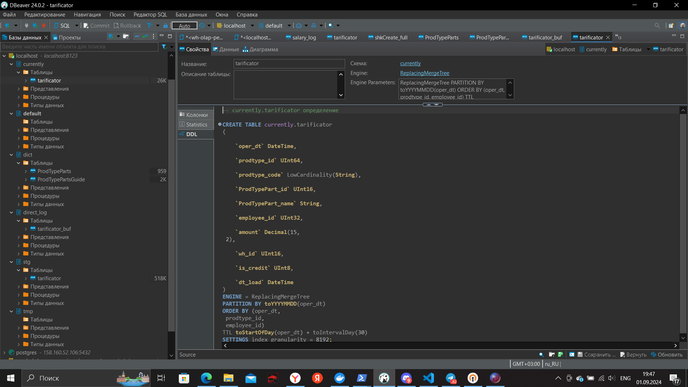
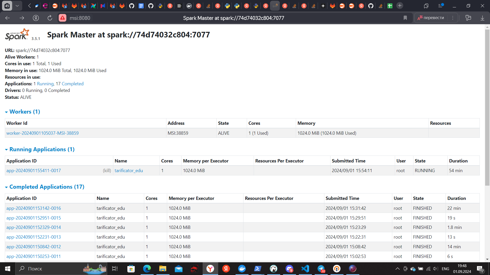
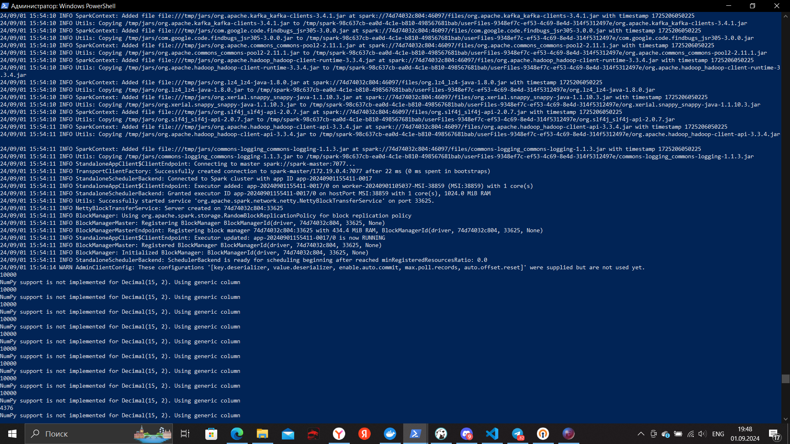

# Spark

## Первый этап

***Создание и запуск контейнеров***

Код для запуска контейнера: 

* [docker-compose](./docker/docker-compose.yml)
* [client.properties](./docker/client.properties)
* [kafka_server_jaas](./docker/kafka_server_jaas.conf)
* [zookeeper_jaas](./docker/zookeeper_jaas.conf)
* [env](./docker/.env)

После этого выполним команду:

```shell
docker compose up -d
```

## Второй этап

***Настраиваем Kafka***

С помощью Offset Explorer подключаемся к кластеру (так как основная настройка была произведена ранее, то настройка минимальна)

В созданном кластере во вкладке JAAS Config прописываем:

```shell
org.apache.kafka.common.security.plain.PlainLoginModule required username="admin" password="admin-secret";
```

Создаем топик - в Offset explorer ПКМ по Topics, ЛКМ по Create Topic

Name: topic_practice_spark

Python-код для заливки данных из таблицы clickohuse в kafka:

* [clickhouse_connect.py](./kafka-python/clickhouse_connect.py)
* [producer.py](./kafka-python/producer.py)

В папке с кодом для kafka запускаем следующую команду, чтобы заполнить топик:

```shell
python producer.py
```

## Третий этап

***Настраиваем Clickhouse***

В Clickhouse выполним следующий код: [ch_init.sql](./clickhouse-sql/ch_init.sql)

Дальше с помощью "Импорт данных" добавим данные в таблицы словарей из файлов CSV, которые были выгружены из Clickhouse.

## Четвертый этап

***Настраиваем Spark***

Код: [tarificator_sync_edu.py](./Streams/tarificator_edu_41/tarificator_sync_edu.py)

В папке, в которой запускали докер, выполним следующую команду, чтобы перейти в терминал контейнера spark-master:

```shell
docker exec -u root -it spark-master /bin/bash
```

Установка необходимых пакетов внутри контейнера:

```shell
pip install clickhouse_driver clickhouse_cityhash lz4 pandas
```

Запуск spark:

```shell
spark-submit --master spark://spark-master:7077 \
    --packages org.apache.spark:spark-sql-kafka-0-10_2.12:3.5.0 \
    --executor-cores 1 \
    --conf spark.driver.extraJavaOptions="-Divy.cache.dir=/tmp -Divy.home=/tmp" \
    /opt/spark/Streams/tarificator_edu_41/tarificator_sync_edu.py
```

## Итог

Таблица currently.tarificator:



***Здесь стоит подметить, что конечных данных гораздо меньше, чем в stg слое - это связано с моментом, что в currently слое использовался движок ReplacingMergeTree, а employee_id я специально занулил***

DDL curently.tarificator:



Web-интерфейс Spark Master:



Spark в консоли:


